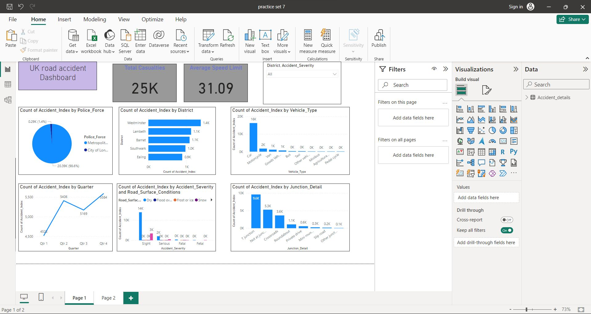

# UKROAD-ACCIDENT-Dashboard-
Creating Dashboard Based on the UK road accident Dataset by using Advanced Power BI Visualisations and Filters

## Problem Statement:
As a beginner in data analytics, the objective of this assignment is to analyze the UK road accident dataset and gain insights into factors affecting road safety and accident severity. By examining the dataset, we aim to explore various aspects of road accidents and address the following questions. By addressing these questions and conducting exploratory analysis on the UK road accident dataset, we aim to gain insights into road safety and accident prevention.

## Insights:
1.T junctions are the hotspot for accidents
2.Cars vehicle are more prone to accidents
3.Westminster, Lambeth, Barnet are the districts with more than 1000 accidents
4.As the number of vehicles involved in accident increases, the average casualties increases
5.Dry road surfaces are accident prone zones
6.98% accidents were investigated by Metropolitan police

## Recommendation:
* 1.Keep T junction ahead and speed limitation board road sign 
* 2.Conduct road safety programs in various districts 
* 3.Ambulance facilities in accident prone districts (Westminster, Lambeth,Barnet)
* 4.Mandate airbags in cars
* 5.Improve dry roads conditions
* 6.Challan for overspeeding
